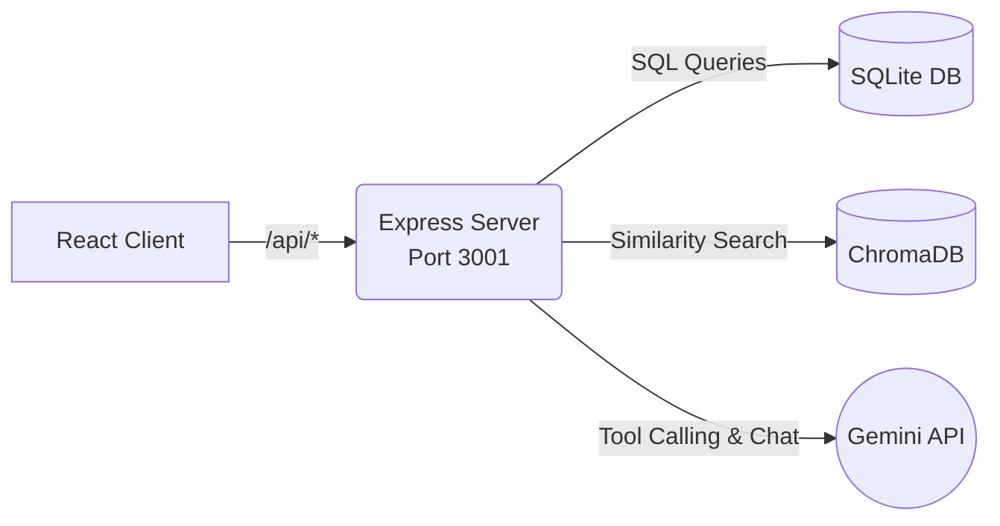

<div align="center">
  <h1>🛡️ FinGuard</h1>
  <p><strong>Transaction Fraud Detection & Customer Intelligence Platform</strong></p>
  <p><em>CP-03 | Sharda University Data Science & Generative AI Programme</em></p>
</div>

<hr />

## 🎯 Problem Statement

Fraudulent transactions make up well under 1% of activity. A model that predicts "not fraud" for every transaction achieves 99.83% accuracy but catches nothing. Detection systems must balance fraud caught against legitimate customers blocked—both sides carry a significant cost. 

**FinGuard** addresses this by building a full-stack fraud detection and investigation platform tailored to operate effectively under severe class imbalance.

## 🚀 Approach

1. **Data Augmentation**: We utilize the Kaggle credit card fraud dataset (`mlg-ulb/creditcardfraud`), which contains ~284,807 real transactions with PCA-anonymized features. We dynamically augment it with synthetic dimensions (customer IDs, merchants, channels, devices) to create a realistic relational structure while preserving the original, authentic fraud signal.
2. **Feature Engineering**: Incorporates time-of-day, day-of-week, rolling per-customer aggregates, velocity measures, and anomaly flags.
3. **Imbalance-Aware Modelling**: Three strategies are evaluated head-to-head (SMOTE, class weighting, threshold tuning) using PR-AUC as the primary metric.
4. **Customer Segmentation**: Unsupervised K-Means clustering identifies behavioral personas, complemented by Isolation Forest anomaly detection.
5. **RAG-Powered Investigation**: Employs policy document retrieval (ChromaDB) and a Gemini-powered Generative AI assistant to summarize cases, provide policy citations, and utilize tool calling to fetch live database records.

> 💡 **Note on Data**: Only the relational metadata is synthetically generated. The fraud signal (Class label) comes entirely from the original Kaggle dataset, satisfying the "public or synthetic data only" restriction.

## 🛠️ Technology Stack

| Layer | Technology |
|-------|-----------|
| **Frontend** | React 18, Vite, Tailwind CSS, Recharts |
| **Backend** | Node.js, Express |
| **Database** | SQLite (via `better-sqlite3`) |
| **ML/Data** | Python (Pandas, Scikit-Learn, Imbalanced-Learn) |
| **Vector Store**| ChromaDB |
| **LLM** | Google Gemini (gemini-3.6-flash) |

## 🏗️ Architecture



## ⚙️ Setup & Installation

### Prerequisites
- Node.js 18+ (Node.js 20+ recommended)
- Python 3.10+
- Kaggle account (for dataset download)
- Google AI Studio API key (for Gemini integration)

### 1. Clone & Configure
```bash
git clone https://github.com/<your-username>/finguard-fraud-detection.git
cd finguard-fraud-detection
cp .env.example .env
# Edit .env with your Gemini API key and Kaggle credentials
```

### 2. Run Python Pipeline
```bash
cd python
pip install -r requirements.txt
python data_pipeline.py     # Download, augment, and feature engineer → SQLite
python model_training.py    # Train models, evaluate, and write scores
python segmentation.py      # Cluster customers and detect anomalies
python analysis.py          # Statistical analysis and plots
python build_vectorstore.py # Build ChromaDB for RAG
```

### 3. Start the Backend Server
```bash
cd server
npm install
npm run dev
```

### 4. Start the Frontend Application
```bash
cd client
npm install
npm run dev
```

Navigate to `http://localhost:5173` to view the application!

## 📊 Key Results

| Metric | Value |
|--------|-------|
| **Dataset size** | 284,807 transactions |
| **Fraud rate** | ~0.17% |
| **Baseline accuracy** | ~99.83% (all-legit prediction) |
| **Best PR-AUC** | Evaluated locally (see `python/outputs/evaluation_metrics.json`) |
| **Segments Found** | 4-6 named customer personas |
| **Documents Indexed**| 6 Synthetic Policy Documents |

## ✅ Functionality Checklist

- [x] Transaction scoring with a tunable decision threshold.
- [x] Investigator queue ranked by risk and value at risk.
- [x] Per-transaction explanation of the fraud flag.
- [x] Customer segmentation with named personas.
- [x] RAG-powered case summary generation with policy citations.
- [x] GenAI Assistant that retrieves customer transaction history on request.

## 📂 Repository Structure

```text
├── python/              # ML pipeline
│   ├── data_pipeline.py
│   ├── model_training.py
│   ├── segmentation.py
│   ├── analysis.py
│   ├── build_vectorstore.py
│   └── policy_docs/     # 6 synthetic policy documents
├── server/              # Node.js/Express backend
│   ├── routes/          # API endpoints
│   └── lib/             # SQLite + Gemini logic
├── client/              # React/Vite frontend
│   └── src/pages/       # UI Components & Dashboards
├── sql/                 # Schema + analytical queries
├── notebooks/           # Executed Jupyter notebooks
└── docs/                # Architecture diagrams + slides
```

<hr />
<div align="center">
  <p>Developed for Sharda University — Data Science & Generative AI Programme</p>
</div>